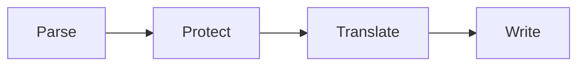

# Babel Fishers

**Localization on your terms.**

Translate your app without breaking it.

Babel Fishers translates your localization files with the provider you choose. It protects placeholders and other parts that must never change. You pay your provider directly, and only for what you use.

```bash
pip install babelfishers
```

[Get started](getting-started/index.md){ .md-button .md-button--primary }
[View on GitHub](https://github.com/Gycks/babelfishers){ .md-button }

!!! note "Early project"

    Babel Fishers is a young project. Suggestions and bug reports are welcome.

## How it works



1. **Parse.** Each source file is read once, whatever its format.
2. **Protect.** Placeholders like `%s` or `{name}` are set aside so they cannot be altered.
3. **Translate.** Only the plain text goes to your provider. Repeated text is answered from a local cache.
4. **Write.** One file per target locale, in the same format as the source.

Read [How it works](concepts/how-it-works.md) for the details.

## What you get

<div class="grid cards" markdown>

-   :material-file-document-multiple:{ .lg .middle } **Ten file formats**

    ---

    JSON, YAML, gettext, XLIFF, Android, Apple, Flutter, .NET and more. Each parser follows its own format's rules.

    [:octicons-arrow-right-24: Supported formats](formats.md)

-   :material-translate:{ .lg .middle } **Nine translation providers**

    ---

    Use DeepL, Azure, Google, OpenAI, Anthropic, Mistral, DeepSeek or a LibreTranslate server that you host.

    [:octicons-arrow-right-24: Translation providers](guides/providers.md)

-   :material-shield-check:{ .lg .middle } **Placeholders stay intact**

    ---

    Variables and plural rules are protected before translation. They come back exactly as they went in.

    [:octicons-arrow-right-24: Placeholders](guides/placeholders.md)

-   :material-book-alphabet:{ .lg .middle } **Glossary support**

    ---

    Keep product names untranslated. Or force a fixed translation for a term in each locale.

    [:octicons-arrow-right-24: Glossaries](guides/glossaries.md)

-   :material-database-outline:{ .lg .middle } **Local translation memory**

    ---

    Text that was translated once is stored on your machine. The same text never costs a second call.

    [:octicons-arrow-right-24: Translation memory](guides/translation-memory.md)

-   :material-eye-outline:{ .lg .middle } **Preview before you commit**

    ---

    Run with `--dry-run` to see what would be translated. Nothing is written until you say so.

    [:octicons-arrow-right-24: CLI reference](reference/cli.md)

</div>

## See it in action

Describe your project in one TOML file.

=== "babelfishers.toml"

    ```toml
    [locale]
    source = "en"
    targets = ["fr", "de", "es"]

    [engine]
    provider = "deepl"

    [resources.json]
    paths = ["locales/[source]/*.json"]
    ```

=== "Run"

    ```bash
    babelfishers translate --dry-run
    babelfishers translate
    ```

=== "Result"

    ```text
    locales/
    ├── en/app.json
    ├── fr/app.json
    ├── de/app.json
    └── es/app.json
    ```

The placeholders in your text survive the trip. This example is illustrative.

=== "en/app.json"

    ```json
    { "greeting": "Hello, {name}! You have %d new messages." }
    ```

=== "fr/app.json"

    ```json
    { "greeting": "Bonjour, {name} ! Vous avez %d nouveaux messages." }
    ```

## Your data stays yours

You run Babel Fishers yourself, on your own files. You use your own account with the provider you pick. 
No file has to leave your machine if you do not want to.

## Next steps

- [Install Babel Fishers and translate your first file](getting-started/index.md)
- [Learn the configuration file](guides/configuration.md)
- [Browse the CLI reference](reference/cli.md)
